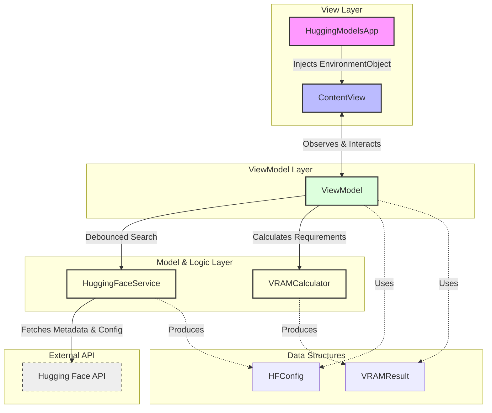
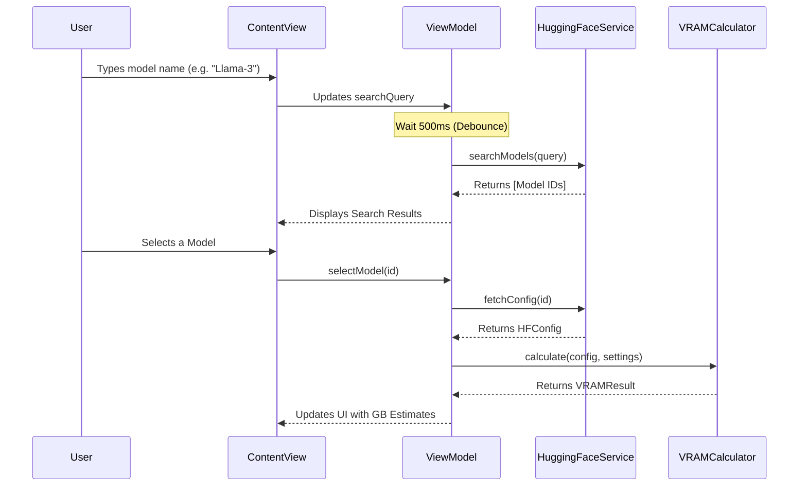

# Project Architecture

## Component Graph

```mermaid
graph TD
    subgraph "View Layer"
        App[HuggingModelsApp] -->|Injects EnvironmentObject| CV[ContentView]
    end

    subgraph "ViewModel Layer"
        CV <-->|Observes & Interacts| VM[ViewModel]
    end

    subgraph "Model & Logic Layer"
        VM -->|Debounced Search| HF[HuggingFaceService]
        VM -->|Calculates Requirements| Calc[VRAMCalculator]
    end

    subgraph "External API"
        HF -->|Fetches Metadata & Config| HfAPI[Hugging Face API]
    end

    subgraph "Data Structures"
        VM -.->|Uses| Config[HFConfig]
        VM -.->|Uses| Result[VRAMResult]
        Calc -.->|Produces| Result
        HF -.->|Produces| Config
    end

    style App fill:#f9f,stroke:#333,stroke-width:2px
    style CV fill:#bbf,stroke:#333,stroke-width:2px
    style VM fill:#dfd,stroke:#333,stroke-width:2px
    style Calc fill:#ffd,stroke:#333,stroke-width:2px
    style HF fill:#ffd,stroke:#333,stroke-width:2px
    style HfAPI fill:#eee,stroke:#333,stroke-dasharray: 5 5
```

## Data Flow Sequence

```mermaid
sequenceDiagram
    participant U as User
    participant V as ContentView
    participant VM as ViewModel
    participant S as HuggingFaceService
    participant C as VRAMCalculator

    U->>V: Types model name (e.g. "Llama-3")
    V->>VM: Updates searchQuery
    Note over VM: Wait 500ms (Debounce)
    VM->>S: searchModels(query)
    S-->>VM: Returns [Model IDs]
    VM-->>V: Displays Search Results
    
    U->>V: Selects a Model
    V->>VM: selectModel(id)
    VM->>S: fetchConfig(id)
    S-->>VM: Returns HFConfig
    VM->>C: calculate(config, settings)
    C-->>VM: Returns VRAMResult
    VM-->>V: Updates UI with GB Estimates
```
